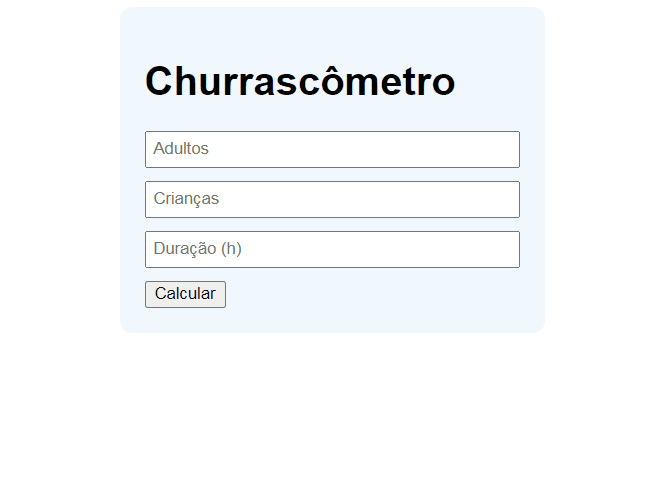

<h1 align="center">
      <a href="#" alt="Página de Captura"> Churrascômetro </a>
</h1>

<h4 align="center">
	🚧   Concluído 🚀 🚧
</h4>

## 💻 Sobre o projeto

Um simples programa que calcula a quantidade de carne e bebidas necessárias pra um churrasco baseado no número de adultos, crianças e horas do churrasco.

## 🎨 Layout

  

## 🚀 Link para testar o projeto

<a href="https://danielsouz4.github.io/churrascometro/">
Clique aqui para testar!
</a>

## 🛠 Tecnologias

Feito com as seguintes ferramentas:

-   Html
-   Css
-   Javascript
